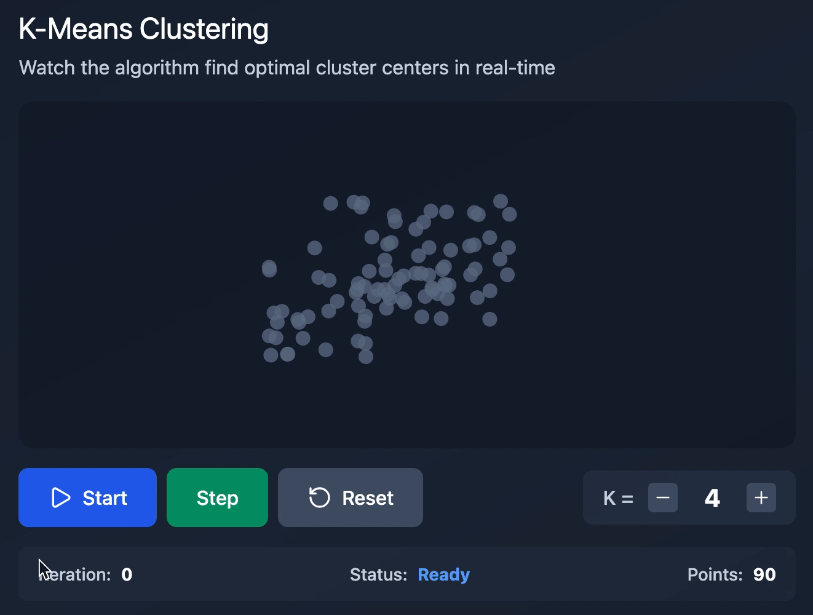

# K-Means Clustering Visualization

An interactive visualization of the **K-Means clustering algorithm**, built with **React** and **SVG**, designed to help understand how centroids move and clusters converge step by step.



---

## ✨ Features

- Interactive K-Means clustering simulation
- Step-by-step execution or auto-run
- Adjustable number of clusters (K)
- Real-time centroid updates
- Visual point-to-centroid connections
- Convergence detection
- Clean, modern UI

---

## 🧠 How K-Means Works

1. Initialize **K** random centroids
2. Assign each point to the nearest centroid
3. Move centroids to the mean of their assigned points
4. Repeat until centroids stop moving (convergence)

---

## 🛠 Tech Stack

- **React**
- **Vite**
- **SVG**
- **Tailwind CSS (CDN)**
- **Lucide Icons**

---

## 🚀 Run Locally

```bash
git clone https://github.com/YOUR_USERNAME/kmeans-visualization.git
cd kmeans-visualization
npm install
npm run dev
